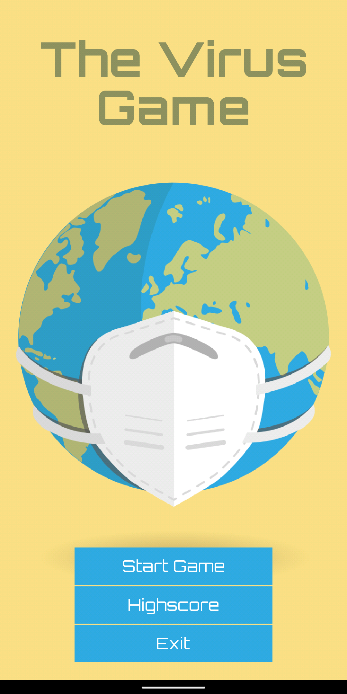

# The Virus Game!
Welcome to The Virus Game – a small, yet engaging game I developed during a bout of boredom. Inspired by the classic Flappy Bird, this game offers a similar challenge: tap the screen to make the hand jump and skillfully navigate through obstacles. In this version, the obstacles are viruses, and your mission is to avoid them at all costs.

Collect hand sanitizers along the way to earn extra points and boost your score!

Special thanks to my sister for creating the game's delightful assets. Unfortunately, due to Google Play's restrictions, this game cannot be distributed on their platform.

Just push the code and deploy from your Android Studio :)

## Screenshots

  
  
  

  
  
  

